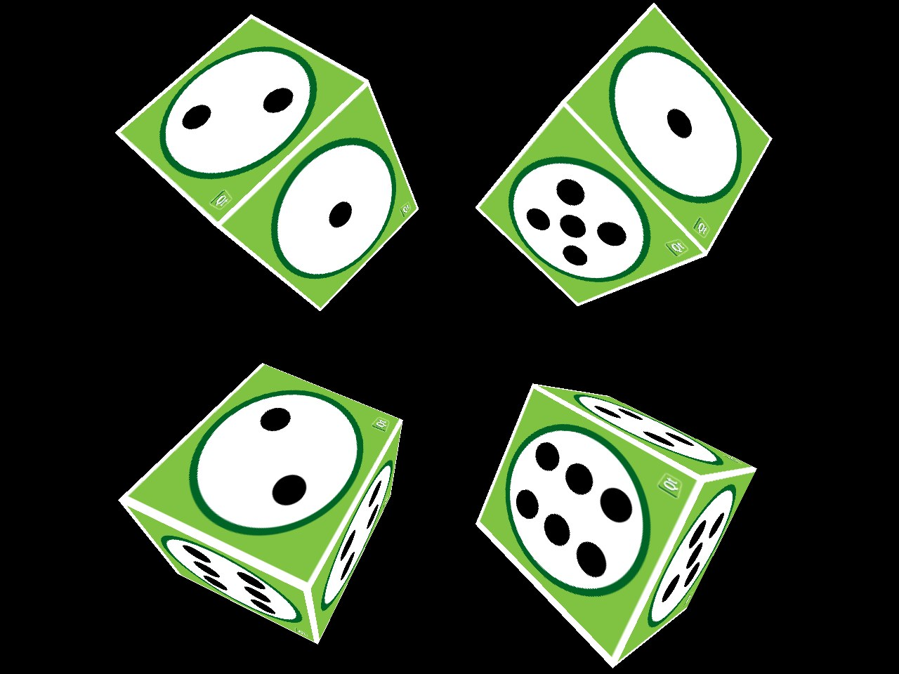

<div align="center">

# Four Cubes

**Four textured dice spinning in mirrored, kaleidoscopic motion, rendered in real-time OpenGL. Flick the scene with your mouse to change the spin.**




</div>

---

## What it does

A compact real-time 3D graphics demo. Four independently positioned cubes, one in each quadrant, are drawn with vertex and fragment shaders and a texture-mapped die face on every side. Click and drag to steer the spin: the drag direction bends the rotation axis and the drag length adds speed. The cubes don't all turn the same way. One follows your rotation, its diagonal partner spins the exact inverse, and the other two use an axis-swapped rotation and its inverse, so the scene moves like a kaleidoscope. The speed also **pulses**: it builds up to a peak, eases back down, and repeats.

## Highlights

- **GPU rendering** with `QOpenGLWidget`, vertex buffers built by a reusable `GeometryEngine`, and GLSL shaders compiled at runtime.
- **Texture mapping:** one image wrapped across all six faces of each cube.
- **Quaternion rotation**, which avoids gimbal lock. Mirrored motion comes from inverting and axis-swapping a single quaternion.
- **Pulsing momentum:** angular speed grows 1% per frame up to a peak, then decays 1% per frame, and repeats. Each mouse flick adds to it.
- **Multiple instances:** a `TextureCube` class encapsulates position, rotation and drawing, so the scene is four objects rather than four copies of code.

## How it works

```
main.cpp            → sets up a 24-bit depth buffer and shows MainWidget
main_widget.*       → mouse input, rotation axis/speed, timer-driven animation, four TextureCubes
texture_cube.*      → per-cube model matrix (translate + rotate), shader and texture binding
geometryengine.*    → cube vertex/index buffers (positions + texture coordinates)
vshader.glsl        → model-view-projection transform
fshader.glsl        → texture sampling
```

## Build and run

Open `four_cubes_anti.pro` in **Qt Creator** (Qt 6) and press **Run**, or:

```sh
qmake four_cubes_anti.pro && make
```

## Credits

Built by **Roszhan Raj** for CSUF computer graphics coursework. It extends Qt's official *Cube OpenGL ES 2.0* example (BSD license); the original notices are kept in the source files.
